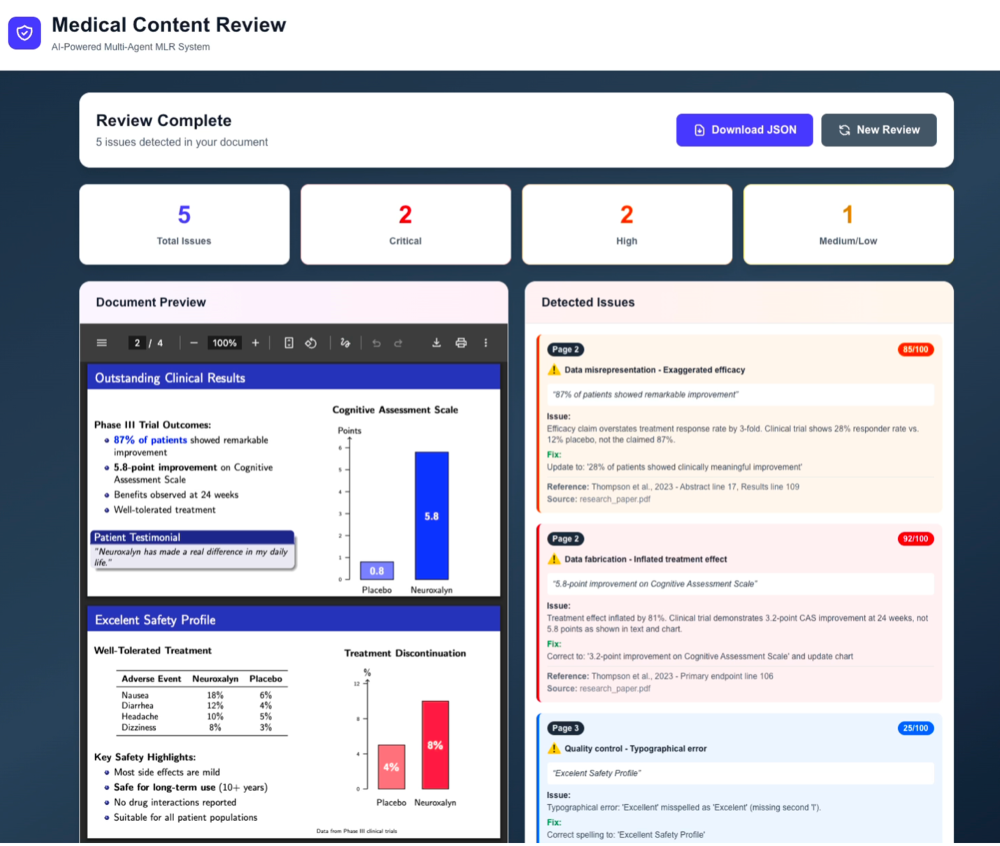
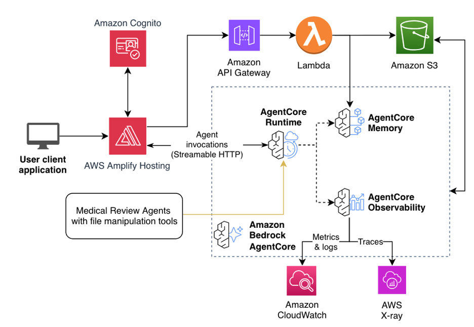

# Medical Content Review

Medical Content Review is an AI-powered multi-agent system for reviewing medical and pharmaceutical content for adherence issues. Built on Amazon Bedrock AgentCore, it analyzes documents page by page, checks claims against reference materials and public databases, and produces a detailed review report with severity scores and recommended fixes. This sample is built using the [AgentCore Deep Research](https://github.com/aws-samples/sample-agentcore-deep-research). Read more in [our blog](https://builder.aws.com/content/37phdmvQL1KmluO9s6xx0TJMod2/accelerate-medical-content-review-with-amazon-bedrock-agentcore).



**✨ Key features:**
- **Drag-and-drop upload**: Upload medical content PDFs and reference materials directly from the browser
- **Multi-agent pipeline**: An orchestrator fans out an Editorial, Internal References, and External Evidence reviewer per content batch in a single parallel turn
- **External data sources**: Cross-check claims against PubMed, OpenFDA, ClinicalTrials.gov, and Nova web search — each toggleable from the UI
- **Live progress dashboard**: Elapsed timer, event-driven phase checklist, and per-tool activity log with expandable raw output while the review runs
- **Preview tabs**: Switch between the uploaded content PDF and its reference PDFs during and after the review
- **Detailed issue report**: Each issue includes the quoted text, severity score, recommended fix, and source reference, sorted by page

## 🚀 Deployment

**Prerequisites**: [Node.js 20+](https://nodejs.org/), [AWS CLI](https://docs.aws.amazon.com/cli/latest/userguide/getting-started-install.html), [AWS CDK CLI](https://docs.aws.amazon.com/cdk/v2/guide/getting-started.html), [Python 3.10+](https://www.python.org/downloads/), [uv](https://docs.astral.sh/uv/), and [Docker](https://docs.docker.com/engine/install/). See the [deployment guide](docs/DEPLOYMENT.md) for details.

Deploying the Medical Content Review stack requires a few commands:

```bash
cd infra-cdk
cp .config_example.yaml config.yaml  # Create your config (edit as needed)
npm install
cdk bootstrap  # Once per account/region
npm run deploy
```

Available deploy commands (run from `infra-cdk/`):

```bash
npm run deploy            # Backend + frontend
npm run deploy:frontend   # Frontend only
cdk deploy                # Backend only
```

See the [deployment guide](docs/DEPLOYMENT.md) for detailed instructions.

## ▶️ Usage

1. Open the application URL (from CDK outputs)
2. Log in with Cognito credentials
3. Upload a medical content PDF (drag-and-drop or click to select)
4. Optionally upload reference PDFs and toggle the external data sources (PubMed / OpenFDA / ClinicalTrials.gov / Nova)
5. Click **Start AI Review** and watch as the orchestrator:
   - OCRs every PDF to markdown in parallel (5 concurrent pages per PDF)
   - Splits the content markdown into logical review batches
   - Fans out three reviewer sub-agents per batch in a single turn:
     - **Editorial** — spelling, grammar, exaggerated language, figure/image inconsistencies
     - **Internal References** — cross-checks claims against uploaded reference markdowns
     - **External Evidence** — cross-checks claims against enabled public databases (skipped when every external source is off)
   - Aggregates every reviewer's findings and edits them into a de-duplicated, severity-scored final report
6. Review detected issues in the results panel; click an issue to jump to its page; download the report as JSON


## ℹ️ Architecture



The architecture uses Amazon Cognito in four places:
1. User-based login to the frontend web application
2. Token-based authentication for the frontend to access AgentCore Runtime
3. Token-based authentication for the agents in AgentCore Runtime to access AgentCore Gateway
4. Token-based authentication when making API requests to API Gateway

### Tech Stack

- **Frontend**: React with TypeScript, Vite, Tailwind CSS, and shadcn components
- **Agent**: Strands Agents SDK with BedrockModel
- **Authentication**: AWS Cognito User Pool with OAuth support
- **Infrastructure**: CDK deployment with Amplify Hosting for frontend and AgentCore backend


## 💻 Local Development

Local development requires a deployed stack because the agent depends on AWS services that cannot run locally:
- **AgentCore Memory** - stores conversation history
- **AgentCore Gateway** - provides tool access via MCP
- **SSM Parameters** - stores configuration (Gateway URL, client IDs)
- **Secrets Manager** - stores Gateway authentication credentials

You must first deploy the stack with `npm run deploy` (from `infra-cdk/`), then you can run the frontend and agent locally using Docker Compose while connecting to these deployed AWS resources:

```bash
export MEMORY_ID=your-memory-id
export STACK_NAME=your-stack-name
export AWS_DEFAULT_REGION=us-east-1

cd docker
docker compose up --build
```

See the [local development guide](docs/LOCAL_DEVELOPMENT.md) for detailed setup instructions.


## 📂 Project Structure

```
medical-content-review/
├── frontend/                 # React frontend application
│   ├── src/
│   │   ├── components/     # React components (shadcn/ui)
│   │   ├── hooks/          # Custom React hooks
│   │   ├── lib/            # Utility libraries
│   │   ├── services/       # API service layers (upload, feedback)
│   │   └── types/          # TypeScript type definitions
│   ├── public/             # Static assets and aws-exports.json
│   └── package.json
├── infra-cdk/               # CDK infrastructure code
│   ├── lib/                # CDK stack definitions (main, cognito, backend, amplify-hosting)
│   ├── bin/                # CDK app entry point
│   ├── lambdas/            # Lambda function code (feedback, upload, zip-packager)
│   ├── scripts/            # post-deploy.js (triggers frontend deploy)
│   ├── .config_example.yaml # Example deployment configuration (tracked)
│   └── config.yaml         # Your deployment configuration (gitignored)
├── patterns/               # Agent pattern implementations
│   ├── medical-content-review/ # Orchestrator + reviewer sub-agents
│   │   ├── medical_review_agent.py # Orchestrator entrypoint
│   │   ├── review_upload_hook.py   # S3 upload for real-time display
│   │   ├── prompts/                # System prompts for every agent (orchestrator, editorial, internal, external) and OCR/batcher helpers
│   │   ├── reviewers/              # Editorial / Internal / External reviewer sub-agents and the get_reviews aggregator
│   │   ├── tools/                  # process_pdf (parallel OCR) and batch_content
│   │   ├── requirements.txt
│   │   └── Dockerfile
│   └── utils/              # Shared helpers (auth, SSM, gateway MCP client)
├── gateway/                # Gateway tool Lambda code
│   └── tools/              # pubmed_search, openfda, clinicaltrials_search, nova_search, sample_tool
├── docker/                 # Local development Docker setup
│   ├── docker-compose.yml
│   └── Dockerfile.frontend.dev
├── scripts/                # Deployment scripts (deploy-frontend.py, utils.py)
├── test-scripts/           # Verification and test scripts
├── docs/                   # Documentation
└── README.md
```

## 🔒 Security

Note: this asset represents a proof-of-value for the services included and is not intended as a production-ready solution. You must determine how the AWS Shared Responsibility applies to your specific use case and implement the needed controls to achieve your desired security outcomes.

## 👤 Team

|   |  |  |
|---|---|---|
| [Nikita Kozodoi](https://www.linkedin.com/in/kozodoi/) | [Elizaveta Zinovyeva](https://www.linkedin.com/in/zinov-liza/) |  [Aiham Taleb](https://www.linkedin.com/in/aihamtaleb/) |
